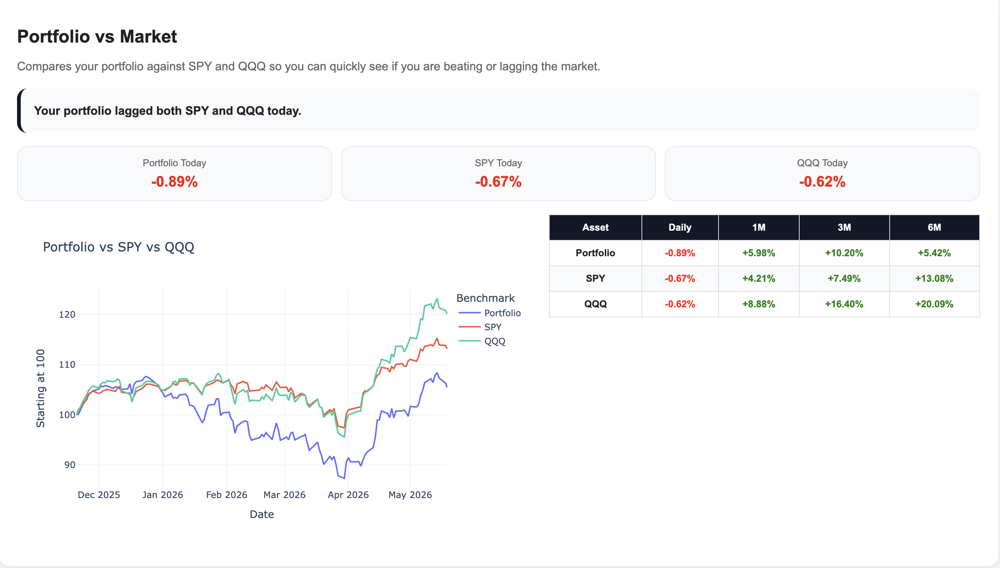
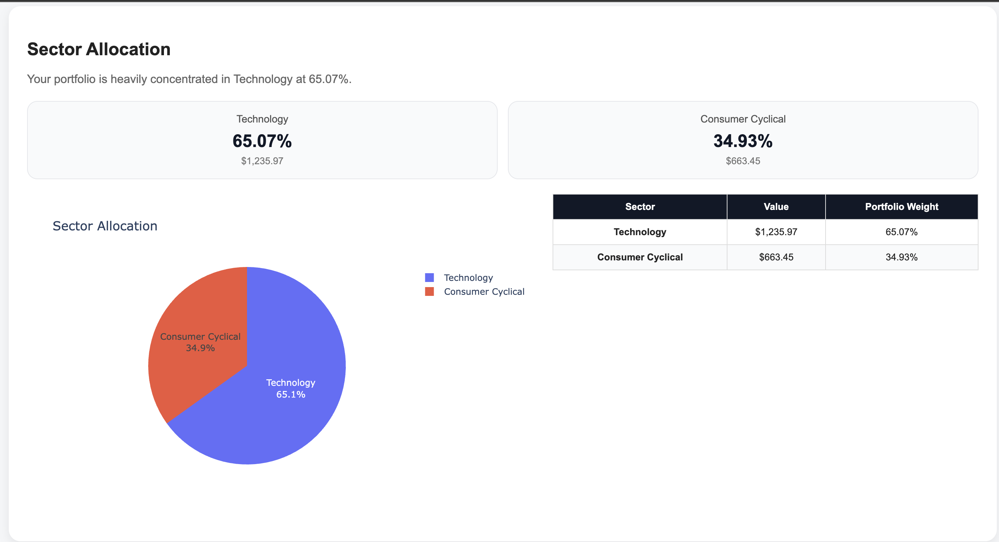
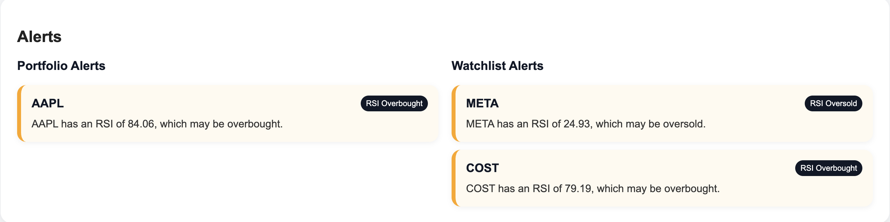

# AI Financial Dashboard

An AI-powered financial dashboard built with Python. It tracks a stock portfolio, watchlist stocks, recent stock news, alerts, benchmark performance, sector allocation, dividends, earnings dates, and AI-generated summaries using local AI through Ollama/Llama 3.2.

This project is designed as a beginner-friendly finance and AI automation project. It combines finance, data analysis, AI summaries, automated reporting, and Mac scheduling into one dashboard.

---

## Screenshots

### Dashboard Overview


### Portfolio vs Market



### AI Summary


### Sector Allocation



### Alerts



---

## How to Use This Project

This project runs locally on your computer. It generates an HTML financial dashboard using your own portfolio and watchlist files.

### 1. Download the project

```bash
git clone https://github.com/saatvikkamjula-glitch/ai-financial-dashboard.git
cd ai-financial-dashboard
```

### 2. Create and activate a virtual environment

```bash
python3 -m venv venv
source venv/bin/activate
```

### 3. Install the required packages

```bash
pip install -r requirements.txt
```

### 4. Install Ollama and Llama 3.2

Install Ollama on your computer, then run:

```bash
ollama pull llama3.2
```

Test that Ollama works:

```bash
ollama run llama3.2
```

If the model opens, type:

```text
/bye
```

Then press Enter to exit the model chat.

### 5. Add your portfolio

Create a file called:

```text
portfolio.csv
```

Example:

```csv
Ticker,Shares,Average Cost
AAPL,2,180
NVDA,1,900
MSFT,1,400
TSLA,1,250
AMZN,1,180
```

### 6. Add your watchlist

Create a file called:

```text
watchlist.csv
```

Example:

```csv
Ticker
AMD
GOOGL
META
JPM
COST
```

### 7. Run the dashboard

```bash
python3 main.py
```

When asked if you want to use the existing portfolio and watchlist files, type:

```text
y
y
```

The dashboard will automatically generate and open in your browser.

### 8. Optional Mac shortcuts

On Mac, users can also double-click:

```text
run_dashboard.command
```

to run the dashboard manually.

They can double-click:

```text
change_schedule.command
```

to change the automatic daily run time.

---

## Features

- Tracks a personal stock portfolio
- Tracks a separate stock watchlist
- Pulls stock data using `yfinance`
- Creates interactive charts using Plotly
- Generates AI portfolio summaries using Ollama/Llama 3.2
- Shows recent stock news for portfolio and watchlist stocks
- Displays a moving stock ticker
- Shows portfolio gain/loss and allocation
- Compares portfolio performance against SPY and QQQ
- Tracks sector allocation
- Tracks dividend information
- Tracks upcoming earnings dates
- Shows watchlist movers and research signals
- Checks automatic alerts for portfolio and watchlist stocks
- Opens the dashboard automatically as an HTML report
- Supports manual running anytime
- Supports scheduled daily running on Mac
- Includes a clickable schedule changer for non-technical users
- Includes report actions such as print/save as PDF and email draft support

---

## Main Dashboard Sections

The dashboard includes:

- Quick snapshot cards
- AI summary
- Portfolio vs market comparison
- Sector allocation
- Dividend information
- Earnings dates
- Report actions
- Alerts
- Watchlist metrics
- Portfolio metrics
- Portfolio news
- Watchlist news
- Portfolio allocation chart
- Gain/loss charts
- Moving average charts
- Volatility chart

---

## Tech Stack

- Python
- pandas
- yfinance
- Plotly
- Ollama
- Llama 3.2
- HTML/CSS
- macOS LaunchAgent scheduler
- Git/GitHub

---

## Project Structure

```text
finance-dashboard/
├── main.py
├── alert_checker.py
├── setup_scheduler.py
├── portfolio.csv
├── watchlist.csv
├── README.md
├── requirements.txt
├── run_dashboard.command
├── run_dashboard_scheduled.command
├── change_schedule.command
├── com.finance.dashboard.plist
├── .gitignore
├── screenshots/
├── reports/
└── venv/
```

Private/local files such as `portfolio.csv`, `watchlist.csv`, `reports/`, and `venv/` should not be pushed to GitHub.

---

## First-Time Setup

Clone the project:

```bash
git clone https://github.com/saatvikkamjula-glitch/ai-financial-dashboard.git
cd ai-financial-dashboard
```

Create a virtual environment:

```bash
python3 -m venv venv
```

Activate the virtual environment:

```bash
source venv/bin/activate
```

Install the required packages:

```bash
pip install -r requirements.txt
```

Install Ollama from the official Ollama website, then pull Llama 3.2:

```bash
ollama pull llama3.2
```

Test that Ollama works:

```bash
ollama run llama3.2
```

If the model opens, type:

```text
/bye
```

Then press Enter to exit the model chat.

---

## Portfolio Input

The portfolio is stored locally in:

```text
portfolio.csv
```

Example format:

```csv
Ticker,Shares,Average Cost
AAPL,2,180
NVDA,1,900
MSFT,1,400
TSLA,1,250
AMZN,1,180
```

The dashboard uses this file to calculate:

- Current value
- Daily gain/loss
- Total gain/loss
- Portfolio weight
- Cost basis
- Performance metrics
- Sector allocation
- Dividend data
- Earnings dates

If `portfolio.csv` does not exist, the program can ask for portfolio input in the Terminal.

---

## Watchlist Input

The watchlist is stored locally in:

```text
watchlist.csv
```

Example format:

```csv
Ticker
AMD
GOOGL
META
JPM
COST
```

The watchlist tracks stocks that are being researched but are not owned yet.

If `watchlist.csv` does not exist, the program can ask for watchlist input in the Terminal.

---

## How to Run Manually

From the project folder:

```bash
cd ~/finance-dashboard
source venv/bin/activate
python3 main.py
```

If you cloned the repo into a different folder, use that folder path instead.

When the program asks:

```text
Do you want to use your existing portfolio.csv? (y/n):
```

Type:

```text
y
```

When it asks:

```text
Do you want to use your existing watchlist.csv? (y/n):
```

Type:

```text
y
```

The dashboard will generate and open automatically in the browser.

---

## Clickable Manual Launcher

For easier use on Mac, double-click:

```text
run_dashboard.command
```

This runs the dashboard and alert checker without typing the full Terminal command every time.

If macOS blocks the file, run this once:

```bash
chmod +x run_dashboard.command
```

---

## Daily Automation

This project uses a Mac LaunchAgent to run automatically every day.

The scheduled launcher is:

```text
run_dashboard_scheduled.command
```

The scheduler file is:

```text
com.finance.dashboard.plist
```

The scheduled run uses existing local files:

```text
portfolio.csv
watchlist.csv
```

and generates a fresh report automatically.

---

## Changing the Schedule

Non-technical users can change the automatic run time by double-clicking:

```text
change_schedule.command
```

Or by running:

```bash
python3 setup_scheduler.py
```

The setup script asks for the hour and minute, then updates the Mac scheduler automatically.

Use 24-hour time:

```text
9:00 AM  = hour 9, minute 0
6:30 PM  = hour 18, minute 30
10:00 PM = hour 22, minute 0
```

---

## Alerts

The alert system checks both:

```text
portfolio.csv
watchlist.csv
```

Alerts can trigger for:

- Large daily moves
- RSI overbought signals
- RSI oversold signals
- Bearish trend signals
- Stocks near 52-week highs
- Stocks far below 52-week highs

Alerts are shown inside the dashboard and are also checked by:

```text
alert_checker.py
```

---

## Benchmark Comparison

The dashboard compares portfolio performance against:

```text
SPY
QQQ
```

This helps show whether the portfolio is beating or lagging the broader market.

The benchmark section includes:

- Portfolio daily performance
- SPY daily performance
- QQQ daily performance
- 1-month, 3-month, and 6-month comparison
- Portfolio vs SPY vs QQQ chart

---

## Sector Allocation

The dashboard groups owned stocks by sector and shows how concentrated the portfolio is.

This helps identify if the portfolio is too heavily focused on one area, such as technology, financial services, consumer cyclical, or communication services.

---

## Dividends and Earnings

The dashboard also includes:

- Dividend information when available
- Dividend yield when available
- Upcoming earnings dates when available

Availability depends on what data is returned by Yahoo Finance through `yfinance`.

---

## Output

The dashboard report is saved here:

```text
reports/financial_dashboard.html
```

The report opens automatically after running the program.

---

## AI Summary

The dashboard uses Ollama with Llama 3.2 to generate a plain-English portfolio summary.

The AI summary explains:

- What happened to the portfolio today
- Best performer
- Worst performer
- Total gain/loss
- Portfolio vs market performance
- Sector allocation
- Dividend notes
- Earnings notes
- Risk and trend notes
- Watchlist observations
- Stock news takeaways
- Beginner-friendly takeaway

This is for educational use only and is not financial advice.

---

## Report Actions

The dashboard includes report actions for easier sharing and saving.

Users can:

- Print the report
- Save the report as a PDF through the browser print menu
- Open a draft email manually

The project does not automatically send emails.

---

## Requirements

Install the required Python packages with:

```bash
pip install -r requirements.txt
```

Main packages:

```text
pandas
yfinance
plotly
```

Ollama must also be installed locally for the AI summary feature.

---

## Important Notes

This project uses free data from Yahoo Finance through `yfinance`.

Because of that:

- Data may be delayed
- News availability can vary by ticker
- Dividend data may not be available for every stock
- Earnings dates may not be available for every stock
- It is not professional tick-by-tick market data
- It should not be used as official financial advice

---

## Privacy

The following files should stay local and should not be uploaded to GitHub:

```text
portfolio.csv
watchlist.csv
reports/
venv/
*.log
```

These are ignored using `.gitignore`.

---

## Future Improvements

Possible future upgrades:

- Add a web app interface
- Add database storage
- Add stronger AI research summaries
- Add backtesting features
- Add multi-portfolio support
- Add risk-adjusted return metrics
- Add automatic PDF export

---

## Disclaimer

This project is for learning, education, and personal finance tracking. It is not financial advice.
